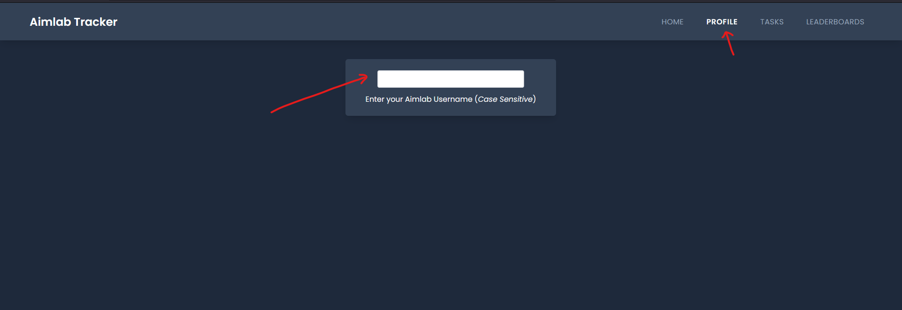
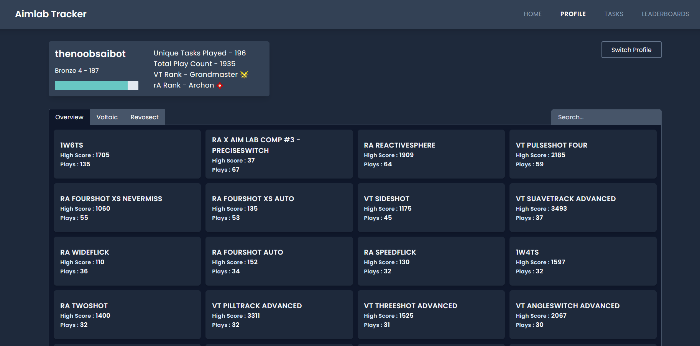
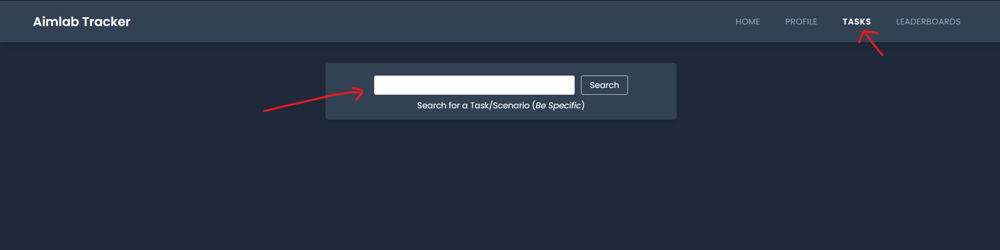
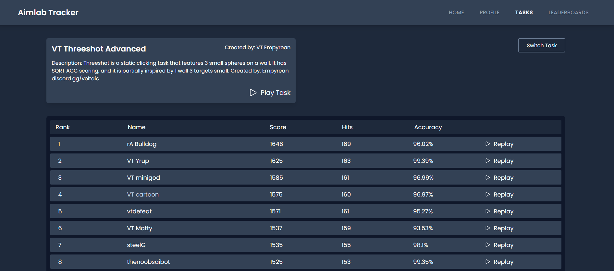

# [Aimlab Stats Tracker](aimlab-tracker.vercel.app)

This is a simple website I created to track Profiles on [Aimlab](https://aimlab.gg)

In addition to tracking Profiles the website also provides stat tracking for [Voltaic](https://voltaic.gg) and [Revosect](https://revosect.com) Benchmarks

## How to use:

## Player Profile

Navigate to the Profile Page and insert a player's username (_case sensitive_)

-   You can use **thenoobsaibot** as an example.

The Player's Profile is presented as such:
From here you can navigate to the [Voltaic](https://voltaic.gg) and [Revosect](https://revosect.com) Benchmarks Pages

## Task

Navigate to the Tasks Page and insert a task name to search

-   You can use **VT Threeshot Advanced** as an example.

The Task is Presented as such, the option to launch Aimlab and play as well as watch replays of players on the leaderboard is presented aswell.

