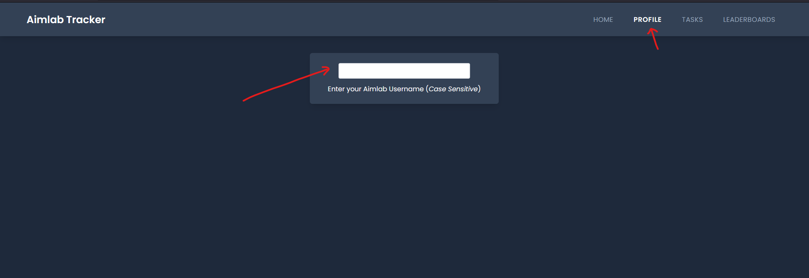
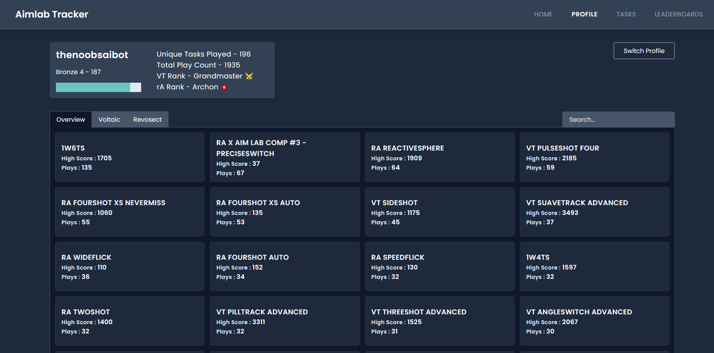
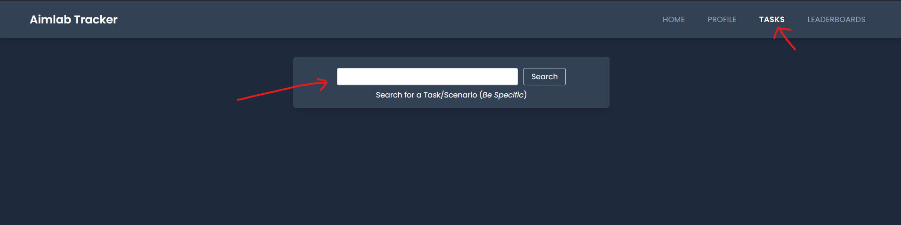
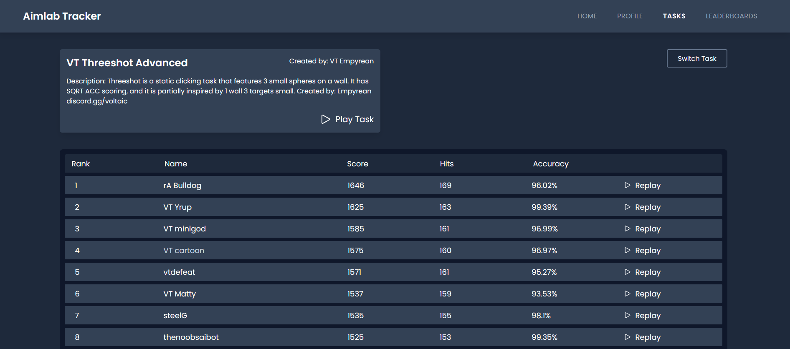

# Aimlab Stats Tracker

This is a simple website I created to track Profiles on [Aimlab](https://aimlab.gg)

In addition to tracking Profiles the website also provides stat tracking for [Voltaic](https://voltaic.gg) and [Revosect](https://revosect.com) Benchmarks

The frontend uses Vue 3, Pinia 4, Vue Router 5, Tailwind CSS 4, and Vite 8 on Node 24. Pinia stores are created per application so server-rendered requests cannot share player or task state. Tailwind's theme lives in `src/style.css`; Vite handles its compilation. Prettier loads its Tailwind plugin through `.prettierrc.json`.

Tailwind 4 requires Chrome 111+, Safari 16.4+, or Firefox 128+. See the [browser requirements](https://tailwindcss.com/docs/compatibility) and [upgrade verification record](docs/stack-upgrade.md).

## How to use:

## Player Profile

Navigate to the Profile Page and insert a player's username (_case sensitive_)

-   You can use **VTSaibot** as an example.



The Player's Profile is presented as such:
From here you can navigate to the [Voltaic](https://voltaic.gg) and [Revosect](https://revosect.com) Benchmarks Pages

Task cards open the best run in a modal; task names link to the scenario leaderboard. The modal also links to the player's run history. The history list shows score, accuracy, shot count, and date. Run details include performance statistics, duration, pause time, versions, and a replay link where available. Leaderboard and benchmark scores open the same modal. Solo history can contain different scenario settings; its count is not a count of comparable benchmark attempts.

Profile benchmark pages separate the benchmark set from difficulty. The selected set and difficulty stay in the URL. Voltaic Season 3 and the current Season 2 definitions use the official `energy-calculation` package on the VPS. Revosect Series 2 retains its verified sheet thresholds and calculation. Voltaic’s `legacy` public URL is an alias for official Aimlabs Season 2; it is not a separate set. The old `vt-novice`, `vt-intermediate`, and `vt-advanced` collector modes remain only for existing production archive jobs/artifacts until production promotion. Revosect Series 4 shows exact playlist scores and runs; ranks await verified Aimlabs requirements. The home difficulty links open the benchmark catalog. **Save profile** stores one shortcut in this browser; it does not verify account ownership.



## Task

Navigate to the Tasks Page and insert a task name to search

-   You can use **VT Threeshot Advanced** as an example.



The Task is Presented as such, the option to launch Aimlab and play as well as watch replays of players on the leaderboard is presented aswell.



## Data inventory

[Aimlabs API data inventory](./docs/aimlabs-data-inventory.md) records verified run, scenario, player, and replay fields, access limits, query examples, backend routes, and remaining processing work.

## Running on a VPS

The canonical production site serves pages, static files, and read-only APIs from the VPS through the existing Cloudflare tunnel.
The [private production site](https://vps.snapper-cod.ts.net:5180/) and [private staging preview](https://vps.snapper-cod.ts.net:5194/) require the owner's tailnet.
See [the VPS deployment guide](docs/vps-site-cutover.md) for routing and rollback.
Vercel aliases and deployment URLs redirect to the canonical site, preserving paths and query strings.
Vercel serves only redirects and the Google verification file. Its deployment URLs have `noindex, nofollow` headers.
Use the private VPS staging preview to verify application changes.

The Node server serves the built site and paged Revosect and Voltaic leaderboards. The refresh command collects Aimlab scores into a resumable SQLite staging database, calculates ranks using the same benchmark functions as player profiles, then atomically publishes one database per benchmark season and level. It keeps the previous published database if Aimlab fails. Large levels take longer to backfill; until one completes, its API returns 503 and the site shows its collection status.

The VPS owns Aimlabs requests, profile aggregation, weighted averages, totals, and all benchmark rank, energy, point, and progress calculations. The browser renders the processed results. Read-only routes are:

- `GET /api/benchmarks/:community`: available sets and score requirements for `voltaic` or `revosect`.
- `GET /api/profiles/:username/lookup`: username and Aimlabs ranking.
- `GET /api/profiles/:username/avatar`: cached 88×88 WebP for the 44-pixel avatar. The VPS accepts only Aimlabs' public avatar bucket, refuses redirects, and limits downloads to 5 MiB, 16 million pixels and four concurrent transforms. Unsupported or unavailable images are omitted.
- `GET /api/profiles/:username`: task summaries, totals, and results grouped by benchmark set.
- `GET /api/tasks/search?name=...` and `GET /api/tasks/:taskId`: search and task metadata.
- `GET /api/tasks/:taskId/leaderboard?page=...`: 25 scores per page, defaulting to normalized mode 0. Run links preserve `mode`; benchmark links supply `weapon` to preserve the benchmark score population when Aimlabs’ task default differs.
- `GET /api/tasks/:taskId/run?username=...&playId=...`: exact run details. Benchmark scores omit `playId` and supply `weapon` and `score`; overview cards also supply the best score’s normalized `mode`. The server checks that the run matches the displayed score and identity.
- `GET /api/profiles/:username/tasks/:taskId/runs?after=...`: 12 public solo plays per cursor page. Existing `?run=...` history links open the modal.

The API uses `api.aimlabs.com/graphql`, caches successful responses briefly, shares identical in-flight app-data, public-details, and run-history requests, caps upstream concurrency at four and responses at 1 MB, and pauses after provider rate limits. Only selected display fields leave the server; no signed replay files are downloaded. `publishedReplay` can expose a run anonymously by its ID, but many older runs are not published. Those modals use allowlisted leaderboard statistics. There is no full-leaderboard scan or unbounded history crawl.

`GET /api/profiles/:username/details` and `GET /api/tasks/:taskId/details` add public activity and scenario metadata from the current Aimlabs API. `GET /api/profiles/:username/activity` supplies yearly and recent active-day counts plus learning-plan totals when the Activity tab opens. These routes return selected display fields and cache them for one minute. Run history has a 45-second cache. Browser profile reentry makes a new request; tab changes reuse the dated snapshot. Failed refresh keeps the previous snapshot with its retrieval time. The profile and task views load their base data through the VPS as well.

Use Node 24 (also recorded in `.node-version`). Development uses the staging API at `http://127.0.0.1:5282` by default; set `AIMLAB_API_ORIGIN` to select another backend.

```sh
npm ci
npm run build
npm run refresh:database
npm start
```

The viewer listens on `127.0.0.1:5180`, serves the full site and APIs, and remains privately reachable through Tailscale Serve. The Cloudflare tunnel routes the canonical public hostname directly to this viewer. The production and staging read-only APIs listen on `127.0.0.1:5182` and `127.0.0.1:5282` and share a Cloudflare Tunnel; its live configuration and credentials stay under `/home/sai/code/aimlab/config/tunnel/`. The staging API service runs from `/home/sai/code/aimlab/worktrees/staging` and reads the published leaderboard databases. The daily production collector includes both official Voltaic seasons and publishes only complete difficulty tables. The production systemd user units in `deploy/` run from `/home/sai/code/aimlab/runtime/current`, store databases in `/home/sai/code/aimlab/data/leaderboards`, and refresh at 04:00 local time. The enabled `aimlab-easy-backfill.service` resumes the initial Easy crawl after a reboot and skips itself once the first Easy database is published. Set `AIMLAB_DATA_DIR` to use another data directory.

The VPS workspace is grouped under `/home/sai/code/aimlab`: `repo/` holds the main checkout, `worktrees/staging/` holds consolidated development, `references/` holds schemas and historical repositories, and `runtime/`, `data/`, and `config/` hold deployment files. The workspace's `README.md` records the directory map and temporary paths retained for the active collector.

Poppins is served locally from versioned `public/fonts/` files under the included SIL Open Font License. Only the four used weights are bundled; existing language subsets are preserved. The regular and semibold Latin subsets are preloaded.

Deploy the VPS avatar route and its `sharp` dependency before the frontend release. The route is additive, so the previous frontend remains compatible; rollback the frontend before removing this backend route.

## Analytics

Production builds upload private browser and SSR source maps to PostHog before publishing. Set build-only `POSTHOG_CLI_API_KEY` (personal key scoped to this project, `error_tracking:write` and `organization:read`), `POSTHOG_CLI_PROJECT_ID=289968`, and `POSTHOG_CLI_HOST=https://eu.posthog.com` in Vercel Production. Keep the key outside Git and runtime/browser configuration. The build injects chunk/release metadata, uploads the matching artifacts, and removes maps from both output directories. Production fails if credentials or upload fail; previews without credentials generate no maps. `app_release` records the deployment commit on browser events.

The [performance dashboard](https://eu.posthog.com/project/289968/dashboard/991103) shows seven-day p75 LCP, INP, and CLS by device, route template, and release, with measurement counts. Query strings are also removed from nested web-vitals URLs.

[PostHog EU](https://eu.posthog.com/project/289968) is the active analytics service for Vercel and the VPS. The personal project is **Aimlab Tracker**, on pay-as-you-go with monthly free allowances; the owner enabled billing for historical imports. Its [production dashboard](https://eu.posthog.com/project/289968/dashboard/987787) shares the same project as web analytics, errors, session replay, logs, and traces. Server events carry their deployment's `environment`. Browser analytics initializes only on `aimlab-tracker.saibot.site` with `environment=production` and no WebDriver automation; VPS, preview, staging, and test visits skip the SDK. The browser shares the canonical origin from `shared/seo.js`.

Two enabled free Drop Events transformations in the personal project also filter pageviews from existing deployments: [exclude VPS and preview URLs](https://eu.posthog.com/project/289968/functions/01a0f61c-c2f5-0000-3b82-a8f49ef88884) allows only `https://aimlab-tracker.saibot.site/` and the former `https://aimlab-tracker.vercel.app/` prefix for still-open older deployments; [exclude nonproduction](https://eu.posthog.com/project/289968/functions/01a0f621-abd5-0000-4f42-b00fd4dc6aa8) drops `$pageview` when `environment` differs from `production`. Backend logs, errors, and traces remain available. These rules do not remove previously ingested test visits. Disable the transformations to roll back, or update their conditions alongside a domain/environment change.

Store `POSTHOG_PROJECT_TOKEN=phc_...`, `POSTHOG_HOST=https://eu.i.posthog.com`, and `POSTHOG_BROWSER_HOST=https://edge.saibot.site` in the owner-only `/home/sai/code/aimlab/config/viewer/posthog.env`. The systemd units read it. `/api/telemetry/config` supplies the public project token and browser proxy to the client; personal API keys and OAuth credentials are never sent to the client. Without the token, analytics is disabled. Restart the relevant web/API services after changing configuration. Active collectors keep their existing configuration until their next run.

Browser events, feature configuration, replay, and SDK assets use the free [PostHog managed proxy](https://posthog.com/docs/advanced/proxy) at `edge.saibot.site`; its CNAME points to `98c838432f15081aede9.cf-prod-eu-proxy.europehog.com` with Cloudflare DNS proxying disabled. `ui_host` stays `https://eu.posthog.com`. VPS exports go directly to EU ingestion, avoiding an extra dependency for server logs and traces. To roll back the browser proxy, remove `POSTHOG_BROWSER_HOST` and restart the web/API services.

Captured data:

- One pageview per successful route change, referrers, devices, and web vitals.
- Automatic clicks, navigation, page leaves, scroll depth, click/movement heatmaps, and rage/dead-click signals. The dashboard includes run completion, returning visitors, navigation paths, and frustration trends.
- Search outcomes, benchmark/difficulty/sort changes, run opens/loads/failures, replay and task launch clicks, and saved-profile changes.
- Browser console logs in PostHog Logs, with query strings, current input text, emails, and credentials redacted before sending. Raw console recording in replay remains disabled because it lacks this redaction hook.
- API route templates, response status, processing duration, cache results, Aimlabs provider failures and rate limits, and request traces. Request and anonymous session IDs link browser failures to VPS logs.
- Collector batch sizes, rate-limit waits, checkpoint progress, completion, and failure. Scores, raw GraphQL queries, variables, provider response bodies, and replay manifests are excluded.

Query strings are removed from analytics URLs, including heatmap page keys. Profile API URLs replace typed player names with `:username`; search terms and input values are excluded, and inputs are masked in session replay. Public player names can appear in visited profile URLs and page content. Replay targets 100% of eligible public sessions with 90-day retention; a project URL blocklist also excludes every other host. Network headers and bodies are excluded. SDK queues, batches, request timeouts, and shutdown waits are bounded; analytics delivery never delays an API response. `posthog-node` is pinned because its tracing API is experimental. Delivery is best effort, not an audit trail. PostHog free retention differs by product; historical VPS archives remain separate.

Surveys and feature-flag loading are enabled in the browser. Experiments can use those flags when a specific change is implemented. No survey or experiment is running. Web analytics, heatmaps, product analytics, SQL, cohorts, replay, errors, logs, and traces share this personal project. Data warehouse sources, external destinations, workflows, AI instrumentation, and Inbox require an actual source, recipient, or app feature; none are connected just to consume an allowance.

[Replay Vision](https://eu.posthog.com/project/289968/replay-vision/01a0f797-f26c-7ac8-a83f-d200200fea4f) automatically checks future recordings for navigation and loading problems. It scans all eligible medium/high-activity sessions, filters internal/test users, uses Gemini 3 Flash at five credits per observation, and has a 2,500-credit monthly cap matching the free allowance. Its initial estimate was zero matching recordings; findings will require real traffic. No historical backfill, automated PRs, or external notifications are enabled. Rate findings on its Calibration tab to improve the prompt.

No-code DOM experiments remain disabled: [PostHog warns that Vue rerenders can overwrite their changes](https://posthog.com/docs/experiments/no-code-web-experiments). Use feature-flag experiments for this app.

On October 1, the personal organization’s USD usage limits were set to **$0** for analytics, replay, flags, errors, surveys, logs, warehouse, destinations, workflows, AI analytics, AI credits, Replay Vision, code usage, and Inbox. Usage stays within each product’s monthly free allowance; capture can stop when an allowance is exhausted. Paid support and retention add-ons are not enabled. Recheck [billing](https://eu.posthog.com/organization/billing) before enabling a new product or paid add-on. The [current free allowances](https://posthog.com/pricing) include 1 million events, 5,000 recordings, 1 million flag requests, 100,000 exceptions, 1,500 survey responses, and 10 GB of logs monthly.

The previous [Umami dashboard](https://vps.snapper-cod.ts.net:5181/websites/101682cb-3775-497a-b68a-b59a22ad10a5) remains an archive. Its frontend script and the Vercel Analytics SDK have been removed. Umami 3.4.0/PostgreSQL run from `deploy/analytics/compose.yaml`; live configuration and owner-only credentials are in `/home/sai/code/aimlab/runtime/analytics`. The database is at `/home/sai/code/aimlab/data/analytics/postgres`, and daily dumps remain indefinitely at `/home/sai/code/aimlab/data/analytics/backups`. Existing Vercel aggregate CSV exports remain at `/home/sai/code/aimlab/data/analytics/vercel-export-2026-09-28-30d/`. They cannot reconstruct sessions or be imported as new PostHog event history.

The October 1 archive contains 1,955 Umami events (1,944 pageviews and 11 search events), 989 anonymous sessions, and no replay data. The private `/home/sai/code/aimlab/data/analytics/posthog-import/production-pageviews.jsonl` contains 1,042 public production pageviews with original UTC timestamps, event UUIDs, anonymous source identities, devices, locations, and referrers; 913 VPS/preview events are excluded. After the owner enabled billing, 441 eligible events were imported and verified against their exact source UUIDs, timestamps, and anonymous IDs with no duplicates. The remaining 601 must reach the [48-hour historical import cutoff](https://posthog.com/docs/migrate); the enabled `aimlab-posthog-history-import.timer` submits them on **October 3, 2026 at 04:19 UTC**. No billing settings were changed during import.

The private import directory contains `manifest.json` with counts and SHA-256, `receipts.json` with accepted batch identities, and `import-pageviews.py`; live units are under `/home/sai/code/aimlab/config/systemd/`. The one-time job holds its own lock, verifies the reviewed file and personal project token, skips previously accepted UUIDs, and sends bounded historical batches directly to EU ingestion. An uncertain request halts the job for record reconciliation instead of retrying automatically. HTTP acceptance and query verification are recorded separately; after the final run, compare all 1,042 source identities/timestamps in PostHog before marking the manifest fully verified. Umami identities cannot be joined reliably to new PostHog visitors. Vercel exports contain aggregate panels only; they cannot recreate individual events, sessions, or replay.

The Revosect calculations use the [Aim Lab progression sheet](https://docs.google.com/spreadsheets/d/1JUTGiKU6u0csCWcmaMTof6Y2LNiZqLyCStH0OzzXYwI/edit?usp=sharing) for the benchmark set included in this repository.

## Verification and publication

Run `npm run build`, `npm test`, and `npm run test:import`. Install the test browser with `npx playwright install chromium`, then run `npm run test:browser`. SEO and browser tests use the built client and server bundles. Browser tests serve the built site on loopback port 5294 and substitute only external data; they do not crawl Aimlabs or attach live databases. Set `PLAYWRIGHT_CHROMIUM_EXECUTABLE_PATH` when using an existing Chromium installation.

### Search indexing

The canonical site renders the existing Vue components through `server/index.js` and `server/page-renderer.js` and serves its own static files and APIs once the direct Cloudflare DNS cutover is applied. Robots are selected from the live hostname/environment, public assets and fonts have immutable caching, private/staging pages stay noindex, and source maps/hidden build files are excluded. For existing Vercel aliases and previews, Vercel uses external rewrites to the existing production/staging API tunnel; it deploys no page-rendering function. The public API serves `/api/pages/public/:path*` for canonical production requests and `/api/pages/preview/:path*` for preview or alternate hosts. The VPS reads its own API over loopback, preserving per-request router/store state and bootstrap data without repeating initial reads in the browser. Vercel's `/assets/:path*` rewrite can serve the matching VPS build assets through `/api/site-assets/:path*`, including during release cutovers; source maps and paths outside built assets are excluded. Public HTML retains its 60-second cache and 300-second stale window; previews and failed reads stay uncached. Missing pages return 404 and upstream failures return 503. `X-Aimlab-Renderer: vps` identifies HTML rendered by the VPS. Deploy compatible production and staging API handlers before publishing these rewrites; keep a verified renderer-capable VPS release for rollback after cutover.

`shared/seo.js` owns page titles, descriptions, canonical URLs, structured data, and social previews. `npm run build` generates `/robots.txt` and `/sitemap.xml` from the committed benchmark definitions without fetching Aimlabs. The sitemap includes benchmark selections and their scenario leaderboards, not player profiles or run histories. Profiles can be indexed through public links; run histories, selected-run links, and alternate standings pages use `noindex`. Vercel previews and private VPS pages are excluded from indexing. Only `https://aimlab-tracker.saibot.site` is the canonical public host. The former `aimlab-tracker.vercel.app` host permanently redirects to the same path and query on this domain; its root redirects directly to `/home`. Keep these redirects indefinitely for bookmarks and links. The old Google verification file stays accessible on its original host to preserve Search Console ownership.

The public Google Search Console verification file is in `public/`. Verify the URL-prefix property and submit `/sitemap.xml` after deployment. For the domain move, keep both properties verified, submit the new sitemap, and use Change of Address on the former property. Search Console reports Google's crawl and indexing decisions; an accepted sitemap does not guarantee search placement.

[API contracts](server/api-contracts.js) document profile snapshots, ranked/scores-only sets and public runs. Calculations and legacy definitions live in `server/benchmark-calculations.js`, `server/benchmark-seasons.js`, and `server/benchmark-registry.js`; browser helpers contain presentation and links.

New publications record definition digest, calculation/data-format versions, collection identity/provider and collection start/finish times. Readers reject mismatched versioned publications with 503. Existing unversioned files remain readable when their recorded identity matches; their missing times/versions stay unknown. Enable `AIMLAB_REQUIRE_VERSIONED_DATA=1` only after all served datasets have versioned metadata. Legacy identity cannot establish every historical threshold or algorithm version.

To rescore retained data without an upstream crawl, use `node server/refresh-database.js --rescore <mode>` under the shared refresh lock. Start in a copied private data directory with `AIMLAB_DATA_DIR`; inspect it before publishing. Rescoring requires the same task order, normalized mode, weapon and collection cutoff. It preserves collection dates and raw scores, computes a separate file, and replaces the published file only on success. Keep a matching definition/database/artifact backup for rollback. Do not erase an incompatible active staging file; start a separate collection directory.

The daily `aimlab-viewer-refresh.timer` runs Revosect and both official Voltaic seasons together under the shared refresh lock. Its service allows 24 hours and resumes saved staging checkpoints after interruption. Completed databases publish atomically; the served database stays available during collection. Disable and remove the old `aimlab-season-refresh.timer` and service when applying these units: the daily collector already includes those modes.

Bulk collection defaults to the existing legacy endpoint. The opt-in `--provider=trainer` adapter retains twenty 100-row pages, pacing, retry and score identity with a separate 8 MB response cap. A resumed collection cannot switch providers. Before changing jobs, finish the active backfill and run `flock -n /home/sai/code/aimlab/data/leaderboards/refresh.lock node scripts/check-collector-parity.js <mode> [scenario-index]`. It compares one sequential batch per provider and reports payload sizes without persisting scores. A matching sample is necessary evidence, not proof of every full crawl. Use a separate data directory for the first Trainer collection; leave live jobs on legacy until reviewed.

Offset-based collection has no provider snapshot token. Collection start/finish times describe its observation window; local completion and atomic publication do not establish an exact point-in-time upstream population. Monitor this window and generation age before claiming exhaustive live standings.

## Analytics recovery

`deploy/analytics/restore-check.py <dump> --credentials <owner-only-file>` restores into disposable PostgreSQL 15 and Umami 3.4 containers on an internal network. It mounts no live volume, publishes no ports, copies existing app encryption keys privately, checks schema/heartbeat/admin login/authenticated websites, then removes its containers and temporary keys. The credentials file contains username and password on separate lines. The September 30 backup passed this rehearsal on 2026-09-30; this does not prove off-VPS recovery or every dashboard feature.

Daily backups remain on this VPS indefinitely; the script does not prune or transfer them. The owner selected this policy on 2026-09-30. Keep the private Compose `.env` and admin credentials available for restoration; a database dump cannot recreate those files. Required database/app/two-factor settings now fail Compose configuration if missing.

## Benchmark definitions and account linking

Run `npm run import:benchmarks` on the VPS to refresh definitions. Python 3 reads Voltaic’s public definition API and Revosect’s official playlist links, resolves the Revosect playlist packages through Aimlabs, then fetches every task’s identity, weapon, version, duration, and creator from `api.aimlabs.com/graphql`. It sends at most one GraphQL batch per second, bounds downloads, and stops on an upstream failure before replacing any definition. Signed package URLs are never saved. The committed snapshots record source and retrieval date; restart the server after a reviewed update.

[Voltaic’s energy utility](https://github.com/VoltaicHQ/energy-calculation) supplies interpolation, category caps, and harmonic aggregation. Version 1.0.1 floors some exact harmonic results one point too low (500 → 499 and 1000 → 999 in our threshold fixtures). The adapter corrects only values within floating-point tolerance of an integer. Tests cover every rank threshold, missing groups, capped categories, and top-tier extrapolation. Revosect’s newer KovaaK’s score sheets are not Aimlabs S4 requirements.

[Aimlabs’ OpenID configuration](https://auth.aimlab.gg/oauth/.well-known/openid-configuration) confirms authorization codes, S256 PKCE, and the `openid user.profile` scopes. On 2026-09-30, the signed-in account’s client-registry and client-registration requests returned `UNAUTHORIZED`; the account settings expose no developer-client registration. OAuth remains blocked on Aimlabs issuing a client under the owner’s existing API-access application. No other application’s client credentials are reused.

Registration details: **Aimlab Tracker**, authorization-code grant, code response, `openid user.profile`, S256 PKCE, and exact staging callback `https://vps.snapper-cod.ts.net:5194/api/auth/callback`. The callback is a proposed registration URL, not an implemented endpoint. Once issued, store credentials only in the VPS environment and implement code exchange, state/nonce checks, verified identity, and private server sessions before enabling sign-in. Production and Vercel callbacks need their own exact approved URLs when supported.
